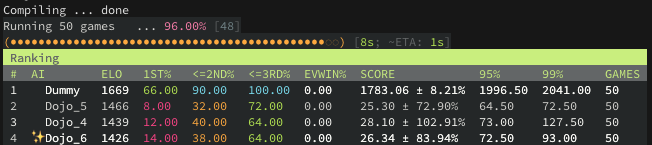
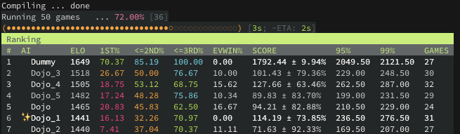

= Dojo

Versioning, running and evaluating EDA Game AIs

== Building

Run `make` to generate the *dojo* executable.

== Installation

Run `make install` to install the built executable on your system.

== Configuration

`dojo` can be configured via:

* CLI options
* The `dojo.toml` configuration file in the current working directory (See link:dojo.toml[dojo.toml] for an example)

When an option is specified both in the configuration file and the CLI, the CLI option
takes precedence.

== Usage

Supose we have the following AI files:

* AIDummy.o
* AIDemo.cc
* AINull.cc
* AIDojo.cc
* AIDojo_1.cc
* AIDojo_2.cc
* AIDojo_3_avoid_enemies.cc

and the link:dojo.toml[dojo.toml] file in the repository:

[source,toml]
----
current-ai = "Dojo"

[run]
players = [ "Dojo", "Dummy", "Dummy", "Dummy" ]
shuffle = false
seed = "time"
printoutput = false

[evaluate]
against = ["Dojo:..-2", "Dummy"]
games = 100
----

== Listing AIs

In order to describe subsets of AIs we use AI descriptors, which have the following format:

`<name>[:[versionFrom[..versionTo]]]`

where `versionFrom` and `versionTo` are integer numbers.

The following examples showcase examples of AI descriptors and the corresponding
subsets they represent.

=== List all AIs

`dojo ai list`

----
╭─ Demo
│  ╰─ AIDemo.cc
├─ Dojo
│  ├─ AIDojo_3_avoid_enemies.cc ✨
│  ├─ AIDojo_2.cc
│  ├─ AIDojo_1.cc
│  ╰─ AIDojo.cc
├─ Dummy
│  ╰─ AIDummy.cc
╰─ Null
   ╰─ AINull.cc
----

=== List specific version

`dojo ai list Dojo:3`

----
── Dojo
   ╰─ AIDojo_3_avoid_enemies.cc ✨
----

`dojo ai list Dojo:0`

----
── Dojo
   ╰─ AIDojo.cc
----

`dojo ai list Dojo:-1`

----
── Dojo
   ╰─ AIDojo_3_avoid_enemies.cc ✨
----

`dojo ai list Dojo`

----
── Dojo
   ╰─ AIDojo_3_avoid_enemies.cc ✨
----

Note that specifying no version defaults to the last version of that AI.

=== List version ranges

`dojo ai list Dojo:1..`

----
── Dojo
   ├─ AIDojo_3_avoid_enemies.cc ✨
   ├─ AIDojo_2.cc
   ╰─ AIDojo_1.cc
----

`dojo ai list Dojo:..-2`

----
── Dojo
   ├─ AIDojo_2.cc
   ├─ AIDojo_1.cc
   ╰─ AIDojo.cc
----

`dojo ai list Dojo:1..2 Dummy`

----
╭─ Dojo
│  ├─ AIDojo_2.cc
│  ╰─ AIDojo_1.cc
╰─ Dummy
   ╰─ AIDummy.cc
----

=== List all versions

`dojo ai list Dojo:`

----
── Dojo
   ├─ AIDojo_3_avoid_enemies.cc ✨
   ├─ AIDojo_2.cc
   ├─ AIDojo_1.cc
   ╰─ AIDojo.cc
----

== Creating a new version

`dojo ai new`

----
🚀 created version 4 for AI Dojo based on AIDojo_3_avoid_enemies.cc
----

Creates the file `AIDojo_4.cc` with the content copied from 
`AIDojo_3_avoid_enemies.cc` and the `#define PLAYER_NAME AIDojo_4`.

=== Specifying a description

You can also specify a *short description* of the changes introduced in the version:

`dojo ai new be_smart`

----
🚀 created version 5 for AI Dojo based on AIDojo_4.cc
----

Creates file `AIDojo_5_be_smart.cc` with the content copied from
`AIDojo_4.cc` and the `#define PLAYER_NAME AIDojo_5`. Note that the description
is not included in the player name because the player name length is very limited.

=== Using a different base AI

`dojo ai new --from Dojo:1`

----
🚀 created version 6 for AI Dojo based on AIDojo_1.cc
----

== Running

`dojo run`

----
Compiling ... done
Running game             ...  0.00% [384.088ms]

   Dojo_6        19
   Dummy         202
✌️  Dummy         1004
   Dummy         393
----

Running looks at the players argument, in this case 
`players = [ "Dojo", "Dummy", "Dummy", "Dummy" ]` from the configuration file. It executes
the run command with the players specified in the same order, where each player
is chosen from the subset of players defined by the AI descriptor.

=== Randomly shuffle the order of the players

`dojo run --shuffle`

----
Compiling ... done
Running game             ...  0.00% [292.813ms]

   Dummy         202
✌️  Dummy         1004
   Dummy         393
   Dojo_6        19
----

=== Print the game output

`dojo run --print-output`

----
Compiling ... done
info: seed 1738030391
info: loading game
Wrong number of cave cells. Generating another grid...
info: loaded game
info: loading player Dojo_6
info: loading player Dummy
info: loading player Dummy
info: loading player Dummy
info: players loaded
info: start round 1
info:     start player 0
info:     end player 0
info:     start player 1
info:     end player 1
info:     start player 2
info:     end player 2
info:     start player 3
info:     end player 3
.
.
.
----

=== Specify a seed

`dojo run --seed 8 --print-output`

----
Compiling ... done
info: seed 8
info: loading game
info: loaded game
info: loading player Dojo_6
info: loading player Dummy
info: loading player Dummy
info: loading player Dummy
info: players loaded
----

=== Specify players

`dojo run -p Dojo: -p Dojo: -p Dummy -p Dojo:..-2`

----
Compiling ... done
Running game             ...  0.00% [291.705ms]

   Dojo          20
   Dojo_5        79
✌️  Dummy         1997
   Dojo_3        41
----

== Evaluation

`dojo evaluate`

image::img/ev.png[]

Evaluate runs a series of games where the AIs that play the game are picked
from the subset described by the `against` argument (list of AI descriptors).
The seed changes on every game run and the player order is always shuffled.

=== Column description

AI:: The name of the AI
ELO:: The https://en.wikipedia.org/wiki/Elo_rating_system[ELO rating] of the AI, computed as all-pair ELO
1ST%:: The win ratio of the AI, calculated as `NUM_WINS/GAMES` where games is the number of games
the AI has played
<=2ND%::The percentage of games the AI played where it placed 2nd or better
<=3RD%::The percentage of games the AI played where it placed 3rd or better
EVWIN%:: Win ratio of the evaluated AI (marked with ✨) over games where the current AI was a player
SCORE:: Average score of the AI
95%:: 95% percentile of the AI score, i.e on 95% of the games the AI has a score less than that
99%:: 99% percentile of the AI score
GAMES:: Number of games the AI played

=== Specify a number of games

`dojo evaluate --games 1000`

=== Change the against subset

`dojo evaluate --against Dummy --against Dojo:-3..-2`

=== Change the evaluated AI

`dojo --ai Dojo:1 evaluate`

